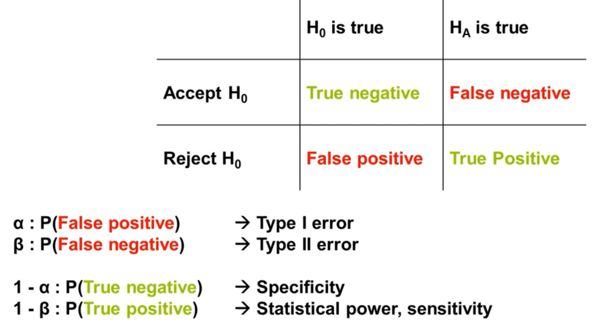
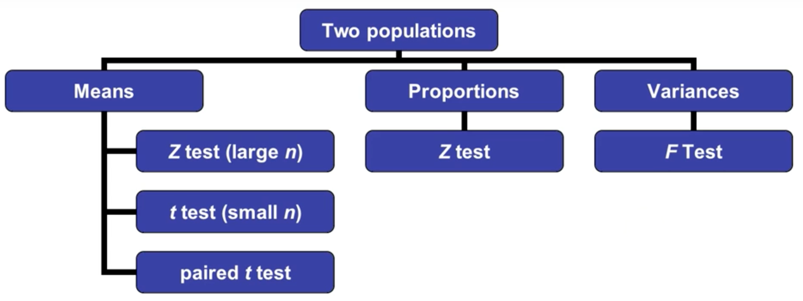

# An ecologically-flavoured introduction to statistics - Day 1

## Goal
acquire an intuition about statistical methods: their nature, usage scenarios, and limitations

## literature
- Galileo Galilei - Il saggiatore
- Sally Calrdwell - Statisctics unplugged
- David Fredman, Robert Pisani, Roger Purves - Statistics
- Darrell Huff - How to lie with statistics
- Shannons theory of information (degree of surprise / contrast)

## Links

- [mathematic symbols 1](https://www.calvin.edu/~rpruim/courses/s341/S17/from-class/MathinRmd.html)
- [mathematic symbols 2](https://oeis.org/wiki/List_of_LaTeX_mathematical_symbols)
- [rmarkdown cheatsheet](https://rstudio.com/wp-content/uploads/2015/02/rmarkdown-cheatsheet.pdf)

## Definitions
### Statistic
A numerical value which characterises the *sample* or *population* from which it was derived
$\rightarrow$ statistics is the study of the collection, analysis, interpretation, presentation, and organisation of data
### Population (sample set)
A complete set fo items that share at least one property in common that is the subject of a statistical analysis.
### Sample (event set)
A *limited number* of observations systematically or (pseudo)randomly selected from a population, whose analysis may yield generalisations about the source population. $\rightarrow$ must be representative
### Statistical estimator
The estimators estimate a population parameter based on sample data

- $\overline{x}$ estimates $\mu$
- $\mu$ is the population *mean*
- $\overline{x}$ is the sample *mean*
- a sample size of 3 is too small to calculate the mean

## Plan an experiment
Design your experiment with the data analysis in mind!

- minimum number if replicates needed $\rightarrow$ perform a power analysis
- disentangle the influence of confounding variables
- determine the statistical analyses that will be used
- one replicates a treatment/effect on an experimental unit
- the effect needs to be independet on one experimental unit
- replicates need to be independet on one another

## data types

- binary (logical)
- quantitative (discontinuous)
- quantitative (continuous)
- ordinal / ranked
- categorical / nominal (can be transformed with dummy numeric variables)

## Location of data
### Pythagorean means
- *the arithmetic mean*: $\overline{x}=\frac{1}{n}\sum_{i=1}^{n} x_{i}$
$\rightarrow$ often refered to as expected value E(X), where X is a random variable
- *the geometric mean*: $\sqrt[n]{\prod_{i=1}^{n} x_{i}}$
- *the harmonic mean*: $\overline{x}=n\sum_{i=1}^{n} \frac{1}{x_{i}}$
$\rightarrow$ inequality concerning AM, GM, and HM: $AM \ge GM \ge HM$

### Statistical location
- *the median*: order your data and take the middle value
- *the mode*: most commen value of a data series
$\rightarrow$ multiple modes possible: unimodal<bimodal<multimodal
$\rightarrow$ different distributions call for different measures of center! The arithmetic mean is not always valid!
- *skewness*: measure of symmetry
$\rightarrow$ negative (left) skewness: the mean of the data values is less than the median
$\rightarrow$ positive (right) skewness: the mean of the data values is larger than the median

## Spread of data

- *range*: highest - lowest value
- *sample variance*: $s^2 = \frac{1}{n-1} \sum_{i=1}^{n} (x_{i}-\overline{x})^2$ 
$\rightarrow$ $s^2 \ge 0$
$\rightarrow$ $s^2 = 0$ all values are equal
- *standard deviation*: $s = \sqrt{\frac{1}{n-1} \sum_{i=1}^{n} (x_{i}-\overline{x})^2}$
$\rightarrow$ standardised form of the variance
- *coefficient of variation*: $\frac{s}{\overline{x}}$
$\rightarrow$ used when comparing multiple samples with different means. Standardisation!
- *concept of central moments*: variance, skewness, and kurtosis are all related through this concept

# An ecologically-flavoured introduction to statistics - Day 2

## The Random Variable

- $X \sim f(p_{1} \dots p_{n})$
- $(x_{i} \dots x_{n}) \in X$
- a variable whose value varies according to chance
- each value has an assigned probability

## Normal distribution

- $X \sim N(\mu, \sigma)$
- only controlled by two variables
- *probability density funciton*: $P(X) = \frac{1}{\sigma \sqrt{2\pi}} e^{-\frac{(x-\mu)^2}{2\sigma^2}}$
- Even if each sample-derived ramdom variable in a large collection of random variables (from the same population) is non-Gaussian, their means are distributed normally!
$\rightarrow$ *central limit theorem*

## Data transformation

- $y' = my+b$
- $y' = \sqrt{y}$
- $y' = \log{y}$
- *Z-score*: $Z = \frac{x_{i}-\overline{x}}{S_{x}}$
$\rightarrow$ standardization! without units!
$\rightarrow$ Based on the normal distribution, standardises normal data to zero mean and unit variance

## Various Distributions

### The Student's t distribution
The result of trying to estimate the mean of a normally distributed population when *n is small and $\sigma$ is unknown*

- n = ~ 30
- $X \sim f(p_{1} \dots p_{n})$
- $X \sim T(\nu)$
- $\nu > 0$: the degrees of freedom

### Degrees of freedom
The number of independent units of information used in the estimation of a parameter or calculation of a statistic ~ the numer of values that are 'free to vary' in this process.
n values have n degrees of freedom until something (e.g. a mean) is estimated - this consumes a degree of freedom $\rightarrow$ this does not apply to non-parametric tests (e.g. spearman correlation coefficient) because the tests use ranks.

### The Discrete Random Variable
A variable whose value, *which is always an integer*, varies according to 'chance'. Each possible value has a probability assigned to it.

- probability mass function for a discrete variable
- assigns a probability to a discrete outcome
- $\overline{x} \rightarrow \mu_{x} = \sum_{i=1}^N p_{i} x_{i}$
- $s^2 \rightarrow \sigma_{x}^2 = \sum_{i=1}^N p_{i}(x_{i}-\mu_{x})^2$

### The Binomial Distribution
The discrete probability distribution of the number of successes in n, independent yes/no experiments. Each trial is associated with a probability of success p, and a probability of failure q (complement), where $q = 1 -p$ (One of the popular discrete variables)

- $X \sim B(n,p)$
- $n \in N$: number of trials $\rightarrow$ not the number of samples from a B(n,p) distribution, but trials within the distribution
- $p \in [0,1]$: failure, success
- the number of successes k, after n independet trials is given by: $P(X=k)=\binom{n}{k}p^k(1-p)^{n-k}$ $\rightarrow$ 
- Bernoulli distribution: yes / no results

### The Poisson Distribution
Associated with rare events $\rightarrow$ probability of k events happening in a given time period or in a given spatial range where $\lambda$ is the expected number of events (known or estimated)
$\rightarrow$ $\approx B(n,p)$ with large n and small p

- $X \sim Pois(\lambda)$
- $\lambda > 0$: equivalent to E(X) and Var(X)
- for $k \in \{1,2,\dots,n\}$, the probability mass funtion of X is: $P(X=k)=\frac{\lambda^ke^{-\lambda}}{k!}$

$\rightarrow$ discrete probability mass function

## Character

*Covariance*
$\rightarrow$ how do the variances of two variables relate?

*Correlation*
$\rightarrow$ Pearson's coefficient: only linear correlation
- Cov(X,Y)/sx*sy
- cares about values
$\rightarrow$ Spearman's rank coefficient: 
- gives the data ranks
- useful for ordinal data

*Linear Regression*
- y = mx + b
- x is the explainatory factor (independent variable)
- y is the response (dependent variable)
- m is the slope
- b is the intercept

- R2: How much covariation does this model explain
- residual: difference between predicted and observed values

- the model transforms the x variable to an approximation of y

# An ecologically-flavoured introduction to statistics - Day 3

## $H_{0}$: The null hypothesis

- Good experimentalists attempt to falsify hypotheses, *not* to confirm them (e.g. confirm $H_{0}$, that there is no effect present)
- [Journal of Articles in Support of the Null Hypothesis](https://www.jasnh.com)

Example with background distribution (N, $\sigma$)
- $H_{0}:E(activity)=\mu$ and $H_{A}:E(activity)<\mu$ 
- $H_{0}:E(activity)=\mu$ and $H_{A}:E(activity)>\mu$
- $H_{0}:E(activity)=\mu$ and $H_{A}:E(activity)\neq\mu$

## Hypothesis testing

$\rightarrow$ the goal of a good experiment is to minimise both Type I and Type II errors

### General procedure

- clearly state $H_{0}, H_{A}, \alpha$ and n
- generate the null distribution
- collect data and calculate the test statistic
- locate where the statistic is in the null distribution
- draw conclusion

### What is a statistically 'significant' result?
If we assume a certain sampling distribution holds for a given statistic, then we can predict how it 'should' behave and react when there's a strong deviation from that expectation.

### The logic of the P value
A P value reflects the probability that $H_{0}$ is true. If it is small (e.g. < 0.05) we can reject $H_{0}$.
It is the probability that one would obtain a test statistic at least as exrtreme as the one observed by chance alone, given $H_{0}$ is true.

- P values have nothing to do with the effect size
- a large P value doesn't mean that the effect size is not there
- most of the time it's more a question of experimental or sampling design (i.e. low n)
- the interpretation of P values is more involved than noted here! Most researchers use them incorrectly, giving them for too much weight
- low P values do not mean that you will automatically be able to replicate your result or generalise your interpretation
- be careful with overreplication
- [Regina Nuzzo - Statistical Errors](https://www.nature.com/articles/506150a)

### Confidence interval
- Often prefered by journals instead of p values
- I can make statements based on my datas variations and the stability of the number of replicates I have, about how likely it is / in which range I would expect the true population parameter (the mean standard deviation) to fall into
- It's more than giving a location of a sample mean I am providing an interval where the sample statistic can catch
- If the population parameter is not in the confidence interval calculated from the observed data, then the data is considered as odd
- confidence level
- [Understanding Confidence Intervals: Statistics Help](https://www.youtube.com/watch?v=tFWsuO9f74o)
- $\overline{x} \pm (z {\frac{\sigma}{\sqrt{n}}})$
- $\rightarrow$ sample mean plusminus the z score times the standard error (variance divided by square root of number of samples) 
- sample mean from normally distributed data will itself be normally distributed (with $\mu$ and standard error ($\frac{\sigma}{\sqrt{n}})$)
- Z scores have a cumulative normal distribution (kind of the factor of sigma for a desired confidence)

- confidence intervals refer to the reliability of an estimation based on some data, not the probability of the parameter actually falling into the interval (the population parameter doesn't change!)
- confidence intervals do not predict where most of your data fall
- like P values, there is no guarantee that the confidence interval will hold in an independent experiment

## statistical tests

- most test rely on *independet* populations (difference between sample means)
- some other test rely on *related* populations

### t-test

- independent, random samples
- normally distributions
- populations variances are unknown but are assumed to be equal
- students t distribution (for small n)
- Z-test for normal distributions (for large n)
- t-test can be used for large n but behaves like the Z test $\rightarrow$ that is why people only talk about the t-test 

### The one-sample t-test

- compare some E(X) to some known value with a known distribution
- usually this value is a mean belonging to a normal distribution
- $H_{0}$: no significant differance between $\mu$ and x
- $H_{A}$: significant difference beween $\mu$ and x
- test statistic is t-statistic
- $t_{obs}=\frac{\overline{X}-\mu}{\frac{s}{\sqrt{n}}}$
- $t_{obs}>t_{n-1,\alpha}$ then we reject $H_{0}$
- $t_{obs}\leq t_{n-1,\alpha}$ then we accept $H_{0}$ (or *not requect* it)
- $t_{n-1,\alpha} \rightarrow$ is the critical value

### The two-sample t-test

- insterested in the location
- similar to one-sided t-test
- covariance instead of variance
- instead of substracting the mean from a given mean we substract the mean of the distribution from the mean of another distribution 
- $t_{obs}=\frac{\overline{X}-\overline{Y}}{\sqrt{\frac{s_{x}^{2}}{n_{x}^{2}}+\frac{s_{y}^{2}}{n_{y}^{2}}}}$
- $t_{obs}>t_{n-2,\alpha}$ then we reject $H_{0}$
- $t_{obs}\leq t_{n-2,\alpha}$ then we accept $H_{0}$ (or *not requect* it)
- $t_{n-2,\alpha} \rightarrow$ is the critical value

### Z-test

- kind of the 
- squares missing
- $z=\frac{\overline{x}-\mu}{\frac{\sigma_{x}}{\sqrt{n}}}$
- $z_{obs}>z_{\alpha}$ then we reject $H_{0}$
- $z_{obs}\leq z_{\alpha}$ then we accept $H_{0}$ (or *not requect* it)
- $z_{\alpha} \rightarrow$ is the critical value

### F-test

--> 50:41 min

- interested in the shape

### Analysis of Variance (ANOVA)
- homoscedasticity
- heteroscedasticity: the variance increases with the x variable
- SSbetween --> fit
- SSwithin --> error

### The $\chi^2$

### Fisher's exact test

## Non-parametric tests
- more robust

## Resampling

### Jackknifing

### Bootstrapping

### Permutation
- within rows
- of rows
- within columns
- of columns

